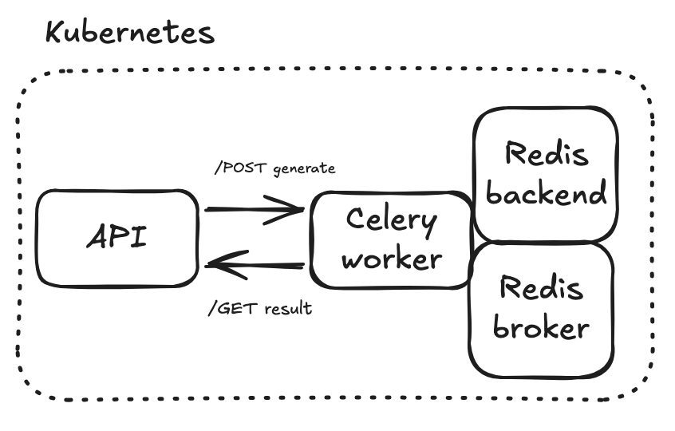

+++
title = "Memory usage of an LLM served via Celery and Kubernetes"
date = "2026-08-25T00:00:00+00:00"

description = "Architecture for a resilient and scalable system that serves a local LLM using Celery and Kubernetes"

tags = ["ml-systems", "inference"]
+++

## Serving an LLM

With demand for LLMs increasing every month, serving them is—and will probably remain for the foreseeable
future—an important topic. In this blog post, I will briefly present a simple architecture that uses Celery and
Kubernetes to serve a (very small) LLM in a way that is robust and, with more effort, should scale.

The service that we want to expose is very simple: a generation endpoint that takes some text and completes
it by generating a certain number of tokens from a given LLM.

For instance:

```
POST /llm-api/generate
{ "text": "The capital of France is" }

{ "response": "Paris.", "code": 200 }
```

After that, I will dive into why, even with a memory limit on our Kubernetes pods that was below
the size of the model, the pods were not killed and we were still able to serve it. That will lead us
into a better understanding of memory management when serving an LLM.

Let's dive in.

## Architecture

Serving an API means optimizing around four metrics (Google's four golden signals
of monitoring):

- Traffic: the load, measured as a given number of requests per second (req/s).
- Latency: the time taken to serve requests, measured, for instance, as p9X latency.
- Errors: the number of failures (errors/s), which should stay below a threshold.
- Saturation: the utilization of resources such as CPU and memory.

Serving an LLM is no different, though it has some specific characteristics:

- Generation requires a lot of memory to compute the forward pass efficiently.
- Acceptable latency is generally on the order of seconds.

How does that translate into architecture? To avoid rejecting requests, it might
be a good idea to use an asynchronous system with a queue. Scaling mechanisms can
then adjust the available resources.

## Implementation

### Architecture



You can find the code [here](https://github.com/guibarrois/gpt2_constrained).
The implementation is fairly minimal:

The API contains two endpoints:

- A `POST /generate` endpoint that triggers the job and returns its ID.
- A `GET /result/<job_id>` endpoint that collects the result.

The Celery worker has a generation task that completes
a text (passed as parameter) with a certain number of tokens (also passed
as a parameter). This generation task is triggered by the generation endpoint,
which returns the ID assigned by the worker.

The API and worker share the same Docker image, which is run with:

- `gunicorn --bind 0.0.0.0:5000 app:app` to serve the API.
- `celery -A tasks worker --concurrency=1 --loglevel=info` for the worker.

A Redis image, which serves as both the broker and the backend, is also built.

### Preloading the weights

To avoid reloading the model weights on each call to the generation endpoint,
the model is loaded in a separate task using the `@worker_process_init`
decorator. The model is cached on a PersistentVolume attached to the
Kubernetes pod with a PersistentVolumeClaim.

## Experimentation

To experiment with Kubernetes resource limits and requests, I conducted a small
experiment to find the minimum amount of memory needed to run the worker.

My mental model was something like this:

- The model weights are approximately 550 MB, so the minimum needed to
  initialize the pod should be around 600 MB.
- Inference uses additional memory for the KV cache, so the limit needed to
  perform generation should be a little higher.

| Memory limit | Initialization | Decoding speed |
|:-------------|:---------------|:---------------|
| 100M         | OOM            | —              |
| 200M         | OOM            | —              |
| 300M         | OOM            | —              |
| 350M         | OOM            | —              |
| *400M*       | *OK*           | *5.2 tokens/s*   |
| 500M         | OK             | 12.5 tokens/s  |
| 1G           | OK             | 14.3 tokens/s  |
| 2G           | OK             | 18.2 tokens/s  |

Everything behaves more or less as expected below 400M: the worker
tries to load the model into memory, but it is too big, so the worker
is killed. At 400M, however, the worker is initialized, the model
is loaded, and you can even run inference (though very slowly).

What is going on here? The model has 124M parameters stored as 32-bit floats.
This is 32 bits × 124M = 3,968 Mbits, or 496 MB, so how can it fit within the
400 MB limit?

## How RAM is handled in the Kubernetes worker

There are several hypotheses that could explain this strange fact:

_Is the size of the model overestimated? No._

First things first, let's measure the memory taken up by the parameters and see
whether it is in line with the estimate of 496 MB above. We can do that by
running this simple Python code after loading the model:

```python
parameter_bytes = sum(
    parameter.numel() * parameter.element_size()
    for parameter in _model.parameters()
)
```

...and we arrive at exactly 498 MB.

_Does the pod have more memory available than its limit? No._

In Kubernetes on Linux, memory limits are enforced using a Linux mechanism
called a `cgroup`. A cgroup is a collection of processes with kernel-enforced
boundaries, including a maximum amount of memory. It is possible to inspect the
memory usage and limit of these cgroups:

```shell
cat /sys/fs/cgroup/memory.max
cat /sys/fs/cgroup/memory.current
```

For the cgroup of interest (the one corresponding to our "magical pod"), these
commands return, respectively:

```
memory.max=399998976 bytes
memory.current=395124736 bytes
```

The memory is full, but the 400M limit is respected. So
how is it possible that the memory used stays below the size of the
model while the worker is still able to serve it?

It turns out that this is possible thanks to another mechanism: `mmap`.

### `mmap` or fake it until you access it

`mmap` applies a lazy-loading technique to memory management: the data that
needs to be in RAM is split into pages, but each page is loaded into RAM only
when the process actually accesses it.

Let's say that you have data that can be split into four pages, but only
two are used by the process. In practice, only those pages need to
be resident in RAM:

```
data
[ A ][ B ][ C ][ D ]

RAM
[ A ][ B ]
```

When page D is accessed, it causes a page fault. Linux makes the page
available in RAM, and the process continues:

```
data
[ A ][ B ][ C ][ D ]

RAM
[ A ][ B ][ D ]
```

But what happens when there is not enough RAM to handle all the data?
The Linux kernel can reclaim file-backed pages: it removes some pages that
can later be loaded again from the original file.

```
RAM
[ A ][ B ][ D ]
        ↓
page C is needed
        ↓
Linux kernel reclaims page B
        ↓
RAM
[ A ][   ][ D ]
        ↓
page C is faulted in
        ↓
RAM
[ A ][ C ][ D ]
```

So perhaps this is what is going on with our model: it is not actually fully
loaded into RAM. During inference, for instance, there is a succession of page
reclaims and faults as the weights of successive layers are loaded.

That would also explain the increase in latency observed when the
pod's memory limit decreases: because less memory is available, there are more
reclaiming and faulting cycles, leading to more disk access and higher latency.

To confirm that this is what is happening, we can analyze how memory is
distributed between anonymous memory (not file-backed and therefore not
reclaimable) and file-backed memory:

```shell
cat /sys/fs/cgroup/memory.stat
```

This returns:

```
anon 375549952
file 14557184
```

This was not what I expected. Around 375 MB of the cgroup memory is anonymous, 
while only around 15 MB is currently file-backed.

This does not rule out the mmap hypothesis, however. The file value 
only tells us how much file-backed memory is currently resident and charged 
to the cgroup. It does not tell us the total size of the file-backed mappings 
that the process can access: mapped pages that are not currently resident do not 
appear in this number.

So one possible explanation is still that the model has a larger file-backed 
mapping, while only a relatively small subset of those pages is resident at 
any given time. As inference moves through the successive transformer 
layers, new pages could be faulted in while older file-backed pages are reclaimed.

However, these counters alone are not enough to prove that this is what 
happens to the model weights. In particular, the 375 MB of anonymous memory 
includes all anonymous memory charged to the cgroup, not only model parameters, 
so it cannot be directly compared with the 498 MB logical size of the model weights.

## Conclusion

It would probably be possible to continue the investigation to rule out
or confirm this hypothesis, but at this point, I feel I have already learned
a lot about memory limits and memory handling in cgroups, so I leave the
rest of the investigation to a motivated reader.

If someone has an alternative explanation for the 400 MB worker serving
a 498 MB model, I would also be very glad to hear it!
